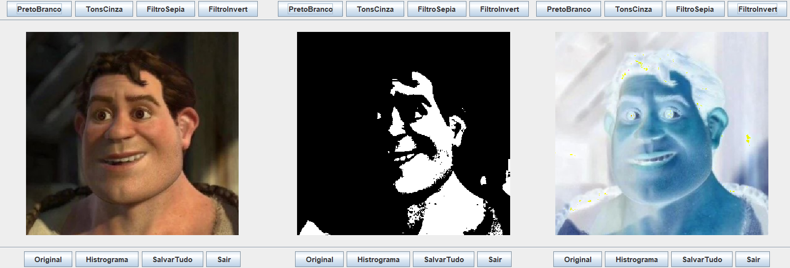

# 🖼️ Photo Effects — Java Image Processing App

<p align="center">
  
</p>

**Photo Effects** is a Java-based desktop application for applying **image filters and transformations** such as grayscale, sepia, black & white, and color inversion. The project was built using AWT and Swing, and includes features for loading, altering, and saving images.

---

## ✨ Features

- 📷 Load image files (JPEG, PNG, BMP)  
- 🧪 Apply image filters:
  - Grayscale
  - Black & White
  - Sepia
  - Inverted Colors  
- 📊 Display image histogram (class `Histograma`)
- 💾 Save modified images
- ✅ Simple GUI made with Swing
- 🧠 Pixel-level transformations implemented manually (matrix manipulation)

---

## 🧠 How it works

The core image processing is handled in the class `AlterarImagem`, where each pixel is transformed and stored into matrices of RGB or grayscale values. Methods like `transTonsC`, `transPB`, `transSP` and `transInv` implement:

- Average-based grayscale
- Thresholded binary black & white
- Weighted sepia transformation
- Color inversion (mirrored from 128 RGB center)

All output is generated using `BufferedImage` with `WritableRaster`.

---

## 📁 Project Files

| File/Class             | Purpose                                           |
|------------------------|---------------------------------------------------|
| `App.java`             | Program entry point                               |
| `Controller.java`      | Handles UI event binding                          |
| `AlterarImagem.java`   | Main image processing logic (filters, matrices)   |
| `CarregarImagem.java`  | File I/O and image loading                        |
| `Histograma.java`      | Histogram visualization and data collection       |
| `package.bluej`        | BlueJ project config                              |

Compiled `.class` and `.ctxt` files are also present, but main focus is on `.java` source files.

---

## 🖥 How to Run

### Option 1: BlueJ

1. Open the folder as a BlueJ project  
2. Run the `App` class  
3. Interact via the GUI

### Option 2: Terminal

```bash
javac *.java
java App
```

---

## 🧪 Sample Image Preview

<p align="center">
  
</p>

---

## 👨‍💻 Authors

Developed by:  
*João Pedro Figols Neco, Júlia Gachido Schmidt, Leonardo Fajardo Grupioni*  
🎓 Computer Science Undergraduate at PUC-SP

---

## 📄 License

For academic and personal use only.
